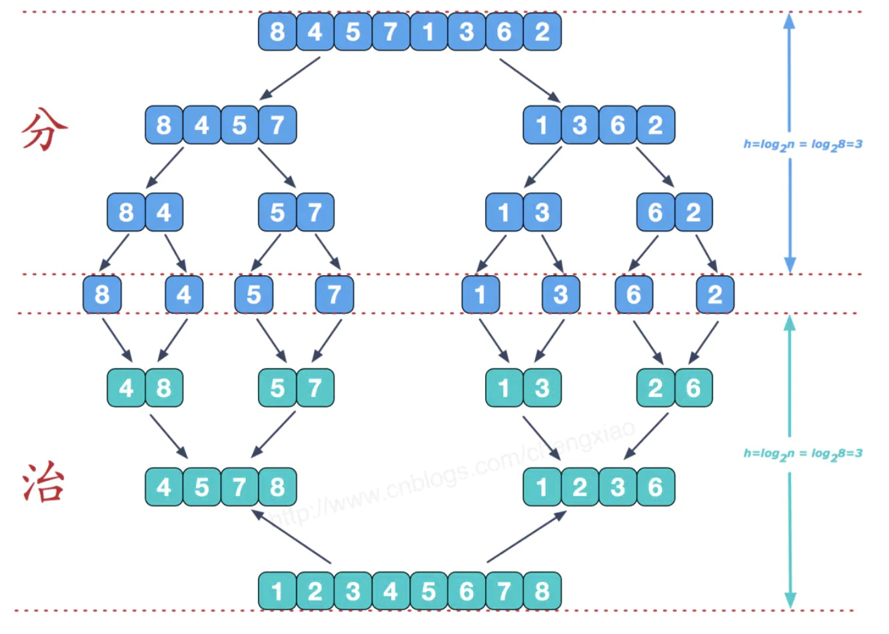

https://www.jianshu.com/p/c6969378e946

归并排序采用的是分治算法的思想，其中最重要的操作就是归并操作。

主要思想是，将数组平分为A，B两部分，分别将A,B两部分排好序，然后再合并，对A排序的时候，也是同样的思路，将A分为两份，同样先分别排序，再合并。一直递归下去，直到不能再分解为止。

网上看到一张图很好的解释了这个过程：

### 归并过程

假设数组已经被分解成了两个有序的数组，这个时候就应该将这两个有序数组合并成一个新的有序数组。
这个时候需要额外的存储空间来辅助这个归并过程**（所以归并排序不是原地排序）**。

