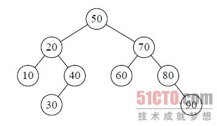
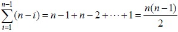

## 快速排序

这个真是经典算法，网上介绍这个算法的文章很多，很少可以讲清楚的，我觉得阮一峰的文章介绍的挺不错的，`http://www.ruanyifeng.com/blog/2011/04/quicksort_in_javascript.html`

> 排序算法（Sorting algorithm）是计算机科学最古老、最基本的课题之一。要想成为合格的程序员，就必须理解和掌握各种排序算法。
目前，最常见的排序算法大概有七八种，其中"快速排序"（Quicksort）使用得最广泛，速度也较快。它是图灵奖得主C. A. R. Hoare（1934--）于1960时提出来的。

"快速排序"的思想很简单，整个排序过程只需要三步：

```
（1）在数据集之中，选择一个元素作为"基准"（pivot）。
（2）所有小于"基准"的元素，都移到"基准"的左边；所有大于"基准"的元素，都移到"基准"的右边。
（3）对"基准"左边和右边的两个子集，不断重复第一步和第二步，直到所有子集只剩下一个元素为止。
```

举例来说，现在有一个数据集`{85, 24, 63, 45, 17, 31, 96, 50}`，怎么对其排序呢？

第一步，选择中间的元素`45`作为"基准"。（基准值可以任意选择，但是选择中间的值比较容易理解。）

第二步，按照顺序，将每个元素与"基准"进行比较，形成两个子集，一个"小于45"，另一个"大于等于45"。得到`24, 17, 31` 45 `85, 63, 96, 50`

第三步，对两个子集不断重复第一步和第二步，直到所有子集只剩下一个元素为止。比如24, `17`, 31 和45和85, `63`, 96, 50。其中45的左边的以17为中间数排序，右边以63为中间数排序。

总结就是分治了。

## c语言实现

阮一峰的博客用的是js实现，和c语言实现是有很大不同的。`http://blog.csdn.net/guoyong10721073/article/details/8025201`这篇博客介绍的不错。运行良好。

## 最差时间和最优情况

`http://blog.csdn.net/weshjiness/article/details/8660583`

我们来分析一下快速排序法的性能。快速排序的时间性能取决于快速排序递归的深度，可以用递归树来描述递归算法的执行情况。如图所示，它是`{50,10,90,30, 70,40,80,60,20}`在快速排序过程中的递归过程。由于我们的第一个关键字是50，正好是待排序的序列的中间值，因此递归树是平衡的，此时性能也比较好。



也就是说，在最优的情况下，快速排序算法的时间复杂度为`O(nlogn)`。

在最坏的情况下，待排序的序列为正序或者逆序，每次划分只得到一个比上一次划分少一个记录的子序列，注意另一个为空。**如果递归树画出来，它就是一棵斜树**。此时需要执行n‐1次递归调用，且第i次划分需要经过n‐i次关键字的比较才能找到第i个记录，也就是枢轴的位置，因此比较次数为：



最终其时间复杂度为`O(n^2)`。

就空间复杂度来说，主要是递归造成的栈空间的使用，最好情况，递归树的深度为log2n，其空间复杂度也就为O(logn)，最坏情况，需要进行n‐1递归调用，其空间复杂度为O(n)，平均情况，空间复杂度也为O(logn)。

可惜的是，由于关键字的比较和交换是跳跃进行的，因此，快速排序是一种不稳定的排序方法。

## 总结

快速排序的基本是分治思想，运行时间是`N*logN`